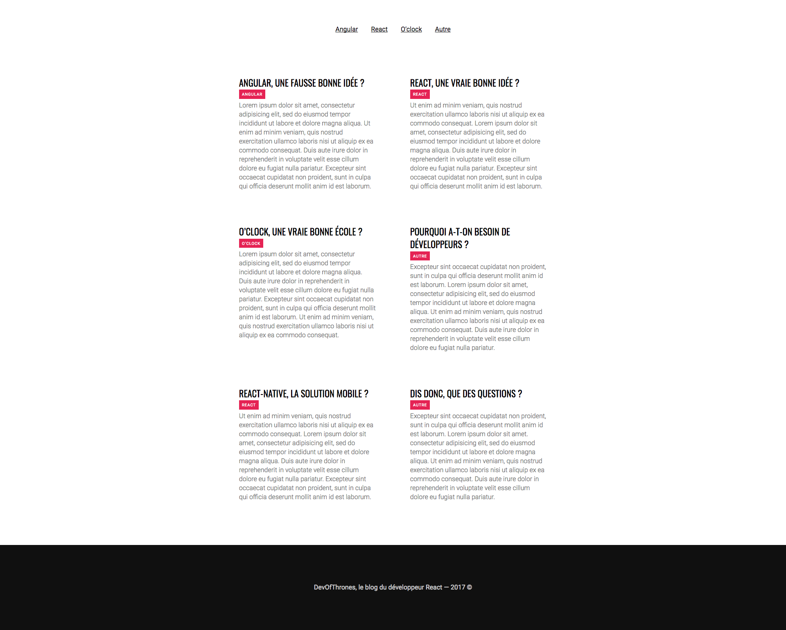

# Challenge : Blog React

## Instructions

* Le but est de **modulariser** le code au maximum. Via des composants React, mais aussi en créant des fichiers de styles séparés.
* Si possible, les datas doivent provenir du composant racine. Vous pouvez très bien faire des composants « impurs » au départ pour commencer…

## Charte graphique

### Google Font

Oswald 400, Roboto 300 et 400 (déjà dans le html)

### Couleurs

* Header #101010 + #e52354 (hover)
* Background d'un post au hover #f0f0f0
* Titre #000
* Category #e52354 + #fff
* Content #777
* Footer #101010 + #ccc
